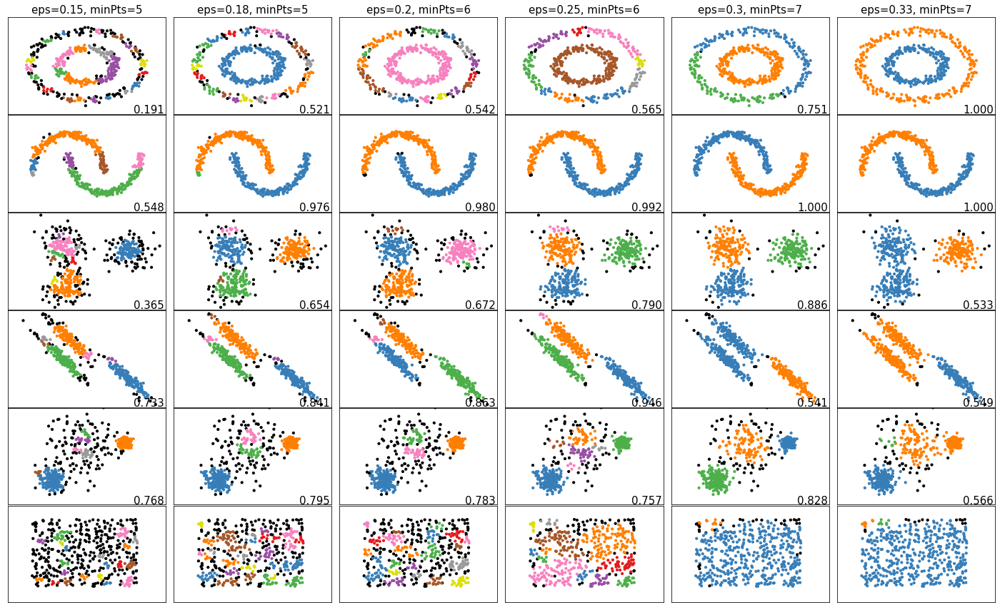

# DBSCAN

Знакомство и реализация алгорима кластеризации __DBSCAN__ (Density-Based Spatial Clustering of Applications with Noise) с целью лучшего понимания его работы. Оценка точность кластеризации при различных настроечных значениях: минимальной плотности объектов, радиуса окружения объекта.

[Отчет](./report.pdf)

Проверка работоспособности реализованного алгоритма на синтетических данных.

 
